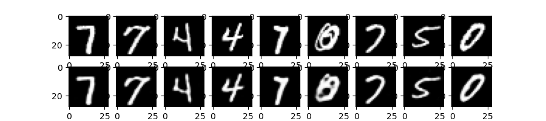
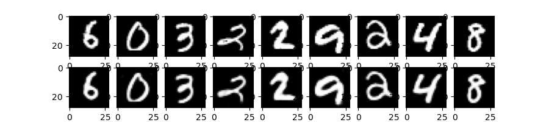
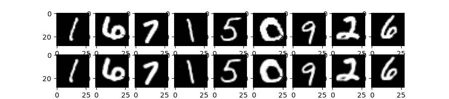
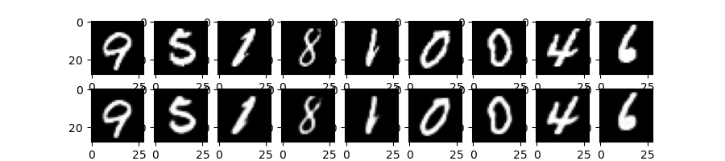
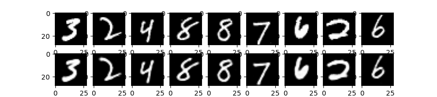

# AutoEncoder_GAN

# Here we are going to compare the Linear vs CNN AutoEncoder models in generating hand written digits using mnist dataset

--- 
Model used: LinearFFN vs CNN
dataset: MNIST dataset

### Introduction
- Actual Task for this project is to compare Linear vs CNN Auto Encoder models
- We are generating hand writen digits in unsupervised learning method
 
### Parameter and Hyper params details

### Observations and results: 

### 1. On 100th Epoch:
#### Linear:

#### CNN:

---

### 2. On 300th Epoch:
#### Linear:

#### CNN:

---

### 3. On 600th Epoch:
#### Linear:

#### CNN:

---

### On 4. 800th Epoch:
#### Linear:

#### CNN:

---

### On 5. 1000th Epoch:
#### Linear:

#### CNN:

